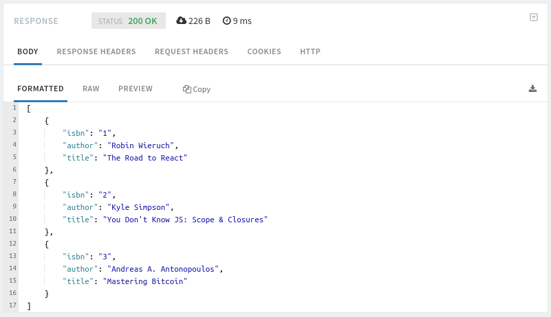
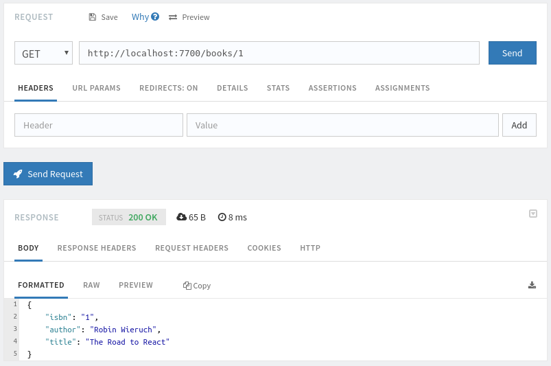
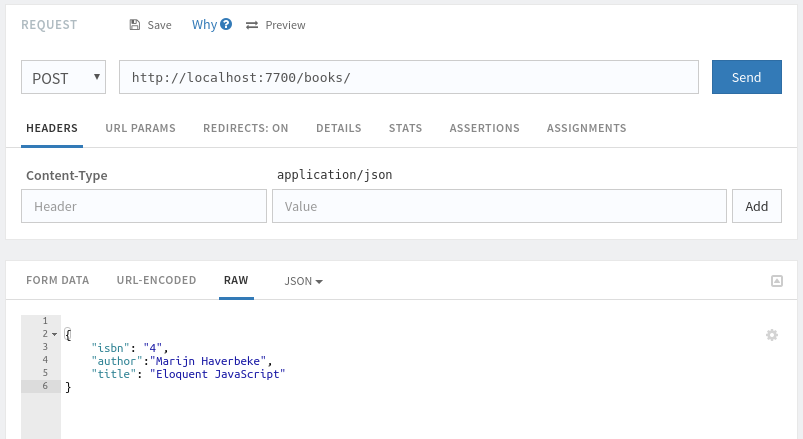
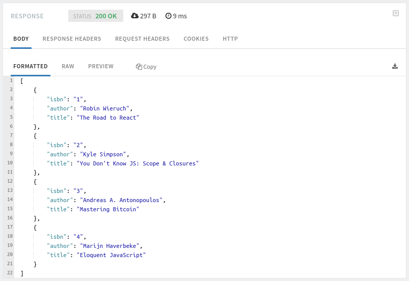
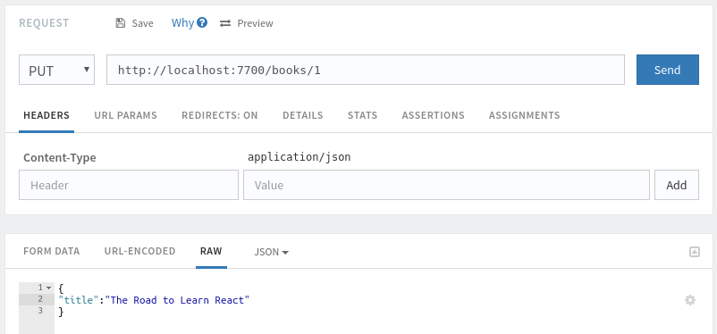
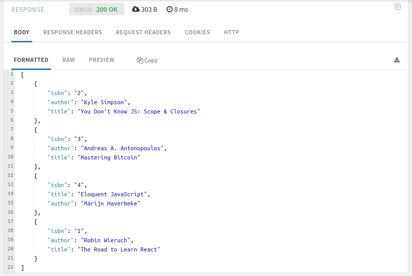
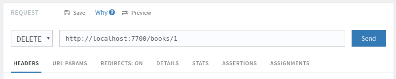
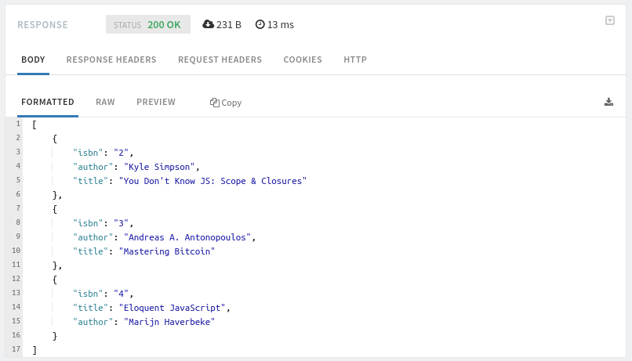

# Deno v1.0


After 2 years of its first release, Deno v1.0 is finally here.


## So, what is Deno anyway ?

>   Deno is a simple, modern and secure runtime for JavaScript and TypeScript that uses V8 and is built in Rust. [Deno's official website](http://deno.land)

Ryan Dahl the original creator of Node.js (the popular server-side JavaScript runtime) announced Deno at JSConf EU 2018 [on is his talk](https://youtu.be/M3BM9TB-8yA) titled "10 Things I Regret About Node.js" ( From the title you can see where are we heading to ). In another word, if you are familiar with Node.js then Deno is just like that. Except that it's improved in many ways, it's created from bottom to top to be a better implementation of Node.js. 


## Simple comparison with Node.js

Since Deno and Node.js serve the same purpose, it's possible to compare the two directly.

|                    |         Node          |        Deno         |
| ------------------ | :-------------------: | :-----------------: |
| Engine             |          V8           |         V8          |
| Written in         |   C++ & JavaScript    |  Rust & Typescript  |
| Package managing   | package managers: npm |      uses URLs      |
| Importing pacakges |    CommonJS syntax    |     ES Modules      |
| Security           |      full access      | permissioned access |
| TypeScript support |     not built in      |      built in       |


## A Deno tutorial

Let's play a little bit with Deno.

### Deno's Installation

To install Deno just copy and paste this command line in your terminal.

```bash
curl -fsSL https://deno.land/x/install/install.sh | sh
```

*For more details check [Deno's official installation guide.](https://github.com/denoland/deno_install)*

When it's done, you will have access to the `deno` command.

You can run `deno --help` to get the list of the options and subcommands provided by Deno, and you can run `deno <subcommand> --help` to get additional informations specific the subcommand for example: `deno run --help`


Now you can run `deno` or `deno repl` to open the REPL (Read-Execute-Print-Loop) and start typing some Javascript

```bash
$ deno repl
Deno 1.0.0
exit using ctrl+d or close()
> console.log("Hello World !")
Hello World !
```


For the mean time (depending on when you're reading this) on **May 14 2020** the REPL supports only Javascript:

>   There are many things we can do to improve the REPL without introducing the TS compiler. We should do those things first (e.g. improve inspect, tab completion). Once we're on par with Node's REPL, we can start looking into how to go beyond that by using typescript. [Ryan Dahl's comment on TypeScript support in REPL](https://github.com/denoland/deno/pull/3760#issuecomment-590472390)


### Run a Deno app

Use `deno run <entry-point>` command to launch a Deno app.

The entry point can be `.js`  file, `.ts` file or even a URL that points to an app entry point and Deno will download, compile and then run it for you:

for example: s

```bash
$ deno run https://deno.land/std/examples/welcome.ts
Download https://deno.land/std/examples/welcome.ts
Compile https://deno.land/std/examples/welcome.ts
Welcome to Deno 🦕
```

If you run the program again, it gets compiled directly it does not need to be downloaded again, it's now cached by Deno:

```bash
$ deno run https://deno.land/std/examples/welcome.ts
Compile https://deno.land/std/examples/welcome.ts
Welcome to Deno 🦕
```

You can force a reload of the original source with the `--reload` flag

```bash
deno run --reload https://deno.land/std/examples/welcome.ts
```

And If you open the [https://deno.land/std/examples/welcome.ts](https://deno.land/std/examples/welcome.ts) URL with
the browser, you'll get the page that contains the code and it's documentation. 

**The Deno website provides other examples in the [examples page](https://deno.land/std/examples/).**


### Let's build a simple REST API

We are going to use [oak framework](https://oakserver.github.io/oak/) and Typescript (you can also use Javascript if you want to)

Let's start by creating an app.ts file and import the `Application` and `server` from https://deno.land/x/oak/mod.ts

```javascript
import { Application } from 'https://deno.land/x/oak/mod.ts'
```

then we need to set the environment variables `HOST` and `PORT`

```typescript
const env = Deno.env.toObject()
const HOST = env.HOST || '127.0.0.1'
const PORT = env.PORT || 7700
```

Now create the routes.ts file import `Router` from https://deno.land/x/oak/mod.ts and create the routes.

```javascript
import { Router }from 'https://deno.land/x/oak/mod.ts'
import { getBooks, getBook, addBook, updateBook, deleteBook } from './controller.ts'

const router = new Router()
router.get('/books', getBooks)
      .get('/books/:isbn', getBook)
      .post('/books', addBook)
      .put('/books/:isbn', updateBook)
      .delete('/books/:isbn', deleteBook)

export default router
```

NOTE: the functions `getBooks`, `getBook`, `addBook`, `updateBook` and `deleteBook` are imported from a local file, it's just we haven't created them yet.

Let's create the controller.ts file and define an interface for a book `IBook`, then we declare an initial array of book objects:

```javascript
interface IBook {
  isbn: string;
  author: string;
  title: string;
}

let books: Array<IBook> = [{
  isbn: "1",
  author: "Robin Wieruch",
  title: "The Road to React",
},{
  isbn: "2",
  author: "Kyle Simpson",
  title: "You Don't Know JS: Scope & Closures",
},{
  isbn: "3",
  author: "Andreas A. Antonopoulos",
  title: "Mastering Bitcoin",
}]
```

Now let's implement the functions one by one

getBooks: returns all the books on the list.

```javascript
const getBooks = ({ response }: { response: any }) => { 
  response.body = books 
}
```



getBook: returns a single book by its isbn, or error message if not found.

```javascript
const getBook = ({ params, response }: { params: { isbn: string }; response: any }) => {
  const book: IBook | undefined = searchBookByIsbn(params.isbn)
  if (book) {
    response.status = 200
    response.body = books[0]
  } else {
    response.status = 404
    response.body = { message: `Book not found.` }
  }   
}
```



addBook: add a book to the books list.

```javascript
const addBook = async ({ request, response }: { request: any; response: any }) => {
  const body = await request.body()
  const book: IBook = body.value  
  books.push(book)
  response.body = { message: 'OK' }
  response.status = 200
}
```





updateBook: updates a book if exists, return error message if not.

```js
const updateBook = async ({ params, request, response }: { params: { isbn: string }; request: any; response: any }) => {
  let book: IBook | undefined = searchBookByIsbn(params.isbn)
  if (book) {
    const body = await request.body()
    const updateInfos: { author?: string; title?: string } = body.value
    book = { ...book, ...updateInfos}
    books = [...books.filter(book => book.isbn !== params.isbn), book]
    response.status = 200
    response.body = { message: 'OK' }
  } else {
    response.status = 404
    response.body = { message: `Book not found` }
  }  
}

```





deleteBook: deletes a book from the books list.

```javascript
const deleteBook = ({ params, response }: { params: { isbn: string }; response: any }) => {
  books = books.filter(book => book.isbn !== params.isbn)
  response.body = { message: 'OK' }
  response.status = 200
}
```






**Here is the [source code on github](https://github.com/AM-77/deno-rest-api)**

## You want more of Deno ?

Here is some resources: [Deno's official website](https://deno.land), [The API documentation](https://doc.deno.land) and you can find a lot more resources, libraries and frameworks in the [Deno's awesome list](https://github.com/denolib/awesome-deno).
